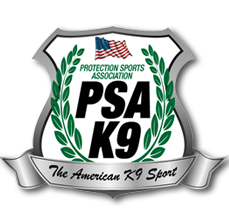

# Protection Sports Association

> The [Protection Sports Association](https://psak9-as.org/psa/) \(PSA\) was conceived and born in 2001 and last year celebrated its 18th anniversary in October of 2018 at the National Championship weekend held in Canada. The sport was the founded by [Jerry Bradshaw](http://www.tarheelcanine.com/2011/09/jerry-bradshaw-ceo-training-director-2/) of [Tarheel Canine Training](http://www.tarheelcanine.com/), Inc and Joe Morris, late of Capital Cities K9 in Baltimore, MD.

